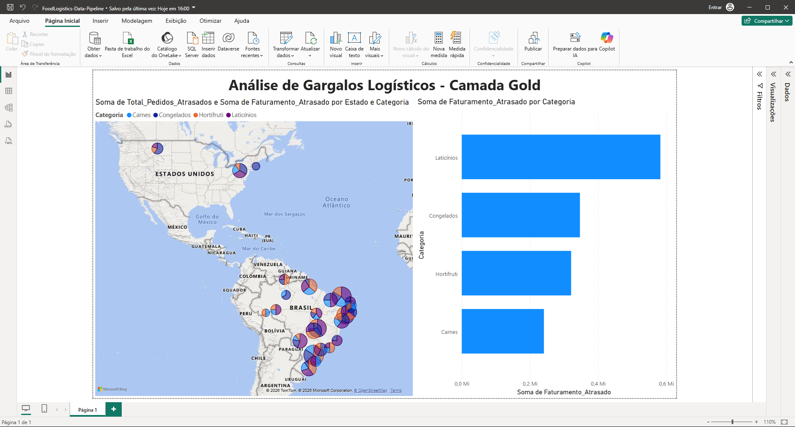

# 🚚 FoodLogistics Data Pipeline



## 📌 Contexto do Projeto
Este projeto simula um pipeline de dados de ponta a ponta (ETL/ELT) focado na análise de eficiência logística na distribuição de alimentos. O objetivo é extrair dados brutos de vendas, clientes e produtos, tratá-los e disponibilizá-los para a tomada de decisão, identificando gargalos financeiros causados por atrasos no frete.

Projeto desenvolvido com foco nos requisitos de Engenharia de Dados em ambientes de Nuvem/Big Data.

## 🛠️ Stack Tecnológica
- **Linguagens:** Python (PySpark) e SQL
- **Processamento:** Databricks (Unity Catalog)
- **Armazenamento:** Data Lake / Volumes (Simulando S3/Azure Data Lake)
- **Visualização:** Power BI

## 🏗️ Arquitetura (Camadas Medallion)
1. **Fonte (ERP Simulado):** Geração de dados sintéticos via Python (biblioteca `Faker`).
2. **Camada Bronze:** Ingestão de arquivos CSV e salvamento em formato Delta.
3. **Camada Silver:** Limpeza de dados (Data Quality), remoção de duplicatas, tratamento de nulos e padronização de strings.
4. **Camada Gold:** Modelagem dimensional e cruzamento de tabelas focadas em regras de negócio.

## 🎯 Demonstração de Conhecimento em SQL
Para atender aos requisitos de modelagem e análise corporativa, a **Camada Gold** foi construída 100% utilizando Spark SQL. 

Abaixo está a query responsável por responder à pergunta de negócio: *"Qual é o faturamento e o custo de frete de produtos atrasados por estado e categoria?"*

```sql
CREATE OR REPLACE TABLE workspace.default.gold_logistica_analitica AS
SELECT 
    c.Estado,
    p.Categoria,
    COUNT(v.ID_Venda) as Total_Pedidos_Atrasados,
    ROUND(SUM(p.Preco), 2) as Faturamento_Atrasado,
    ROUND(SUM(v.Custo_Frete), 2) as Custo_Total_Frete_Atraso
FROM workspace.default.silver_vendas_logistica v
JOIN workspace.default.silver_clientes c 
    ON v.ID_Cliente = c.ID_Cliente
JOIN workspace.default.silver_produtos p 
    ON v.ID_Produto = p.ID_Produto
WHERE v.Status_Entrega = 'atrasado'
GROUP BY 
    c.Estado, 
    p.Categoria;

## (Utilizei SELECT, INNER JOIN para unificar tabelas de dimensões/fatos, a cláusula WHERE para filtrar as entregas com gargalo e funções de agregação com GROUP BY).